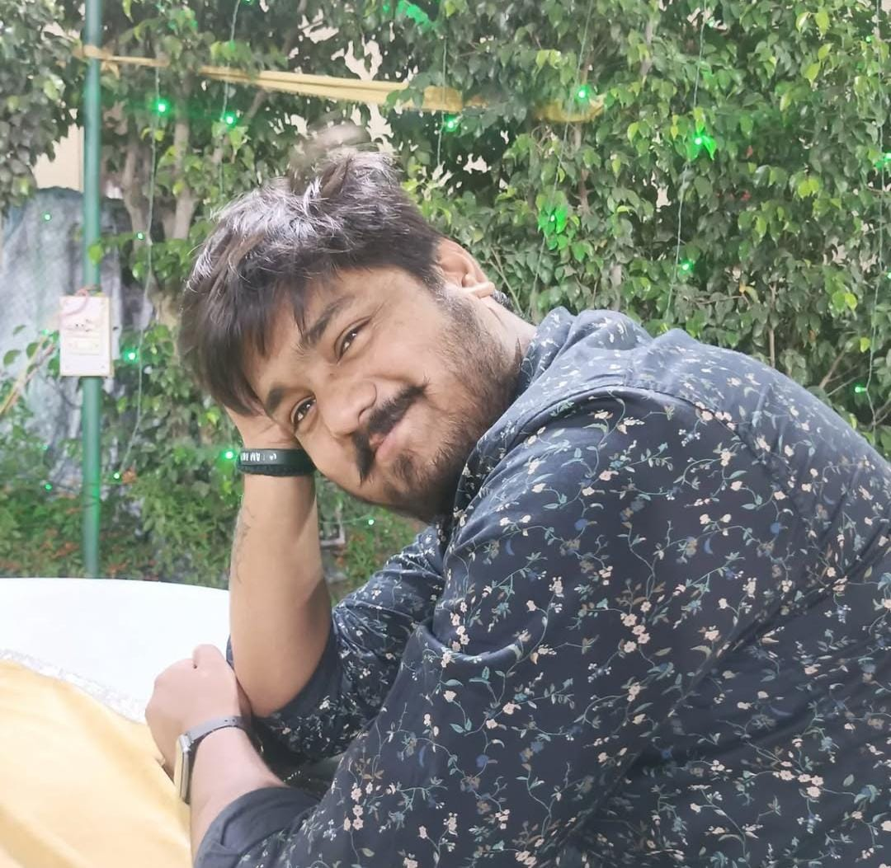

<html lang="en">
<head>
    <meta charset="UTF-8">
    <meta name="viewport" content="width=device-width, initial-scale=1.0">
    <title>Harsh Sinha - Portfolio</title>
    <link rel="stylesheet" href="styles.css">
    
    
</head>
<body>
    <header>
        <h1>Harsh Sinha</h1>
        
Backend Developer

        
        <nav>
            <ul>
                <li><a href="#about">About</a></li>
                <li><a href="#projects">Projects</a></li>
                <li><a href="#skills">Skills</a></li>
                <li><a href="#education">Education</a></li>
                <li><a href="#contact">Contact</a></li>
            </ul>
        </nav>
    </header>
    
    <section id="about" class="section">
        <h2>About Me</h2>
        
Enthusiastic and resourceful Computer Science graduate with a strong background in backend development and problem-solving.

    </section>
    
    <section id="projects" class="section">
        <h2>Projects</h2>
        

            <h3>Jarvis Automation</h3>
            
AI-based automation using Python and Speech Recognition.

        

        

            <h3>Security Camera</h3>
            
Facial recognition-based security system using OpenCV.

        

    </section>
    
    <section id="skills" class="section">
        <h2>Skills</h2>
        

            <ul>
                <li>Java, Python, Go</li>
                <li>SQL, MySQL</li>
                <li>Data Structures & Algorithms</li>
                <li>Machine Learning</li>
                <li>Networking & Linux</li>
            </ul>
        

    </section>
    
    <section id="education" class="section">
        <h2>Education</h2>
        
MCA - Galgotias University (Pursuing)

        
BCA - IGNOU, Delhi (CGPA: 6.5)

    </section>
    
    <section id="contact" class="section">
        <h2>Contact</h2>
        
Email: harshlogan20@gmail.com

        
Phone: +91 7827750546

        
LinkedIn: <a href="https://www.linkedin.com/in/harsh-sinha-15b20a193">Profile</a>

    </section>
    
    <footer>
        
&copy; 2025 Harsh Sinha | All Rights Reserved

    </footer>
</body>
</html>
